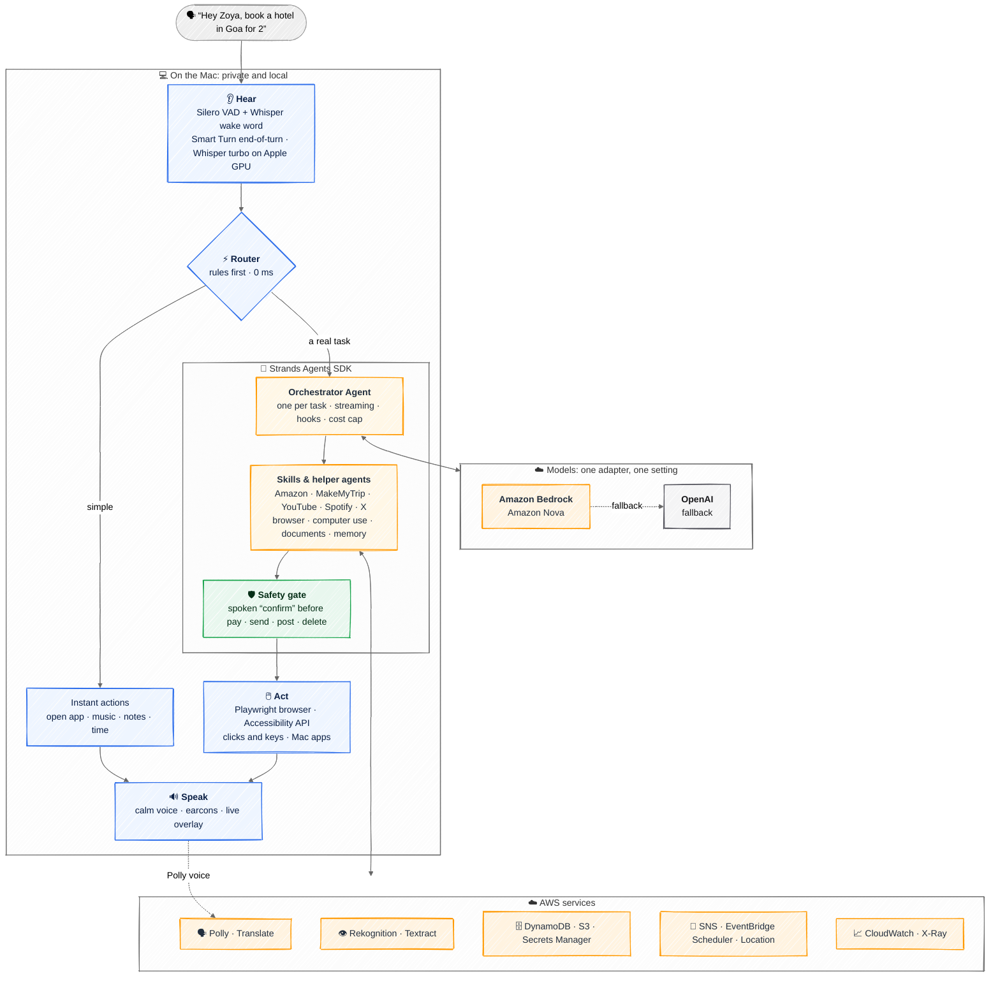

# Zoya

**A voice-first AI agent that operates a Mac for blind and low-vision people.**

Say **"Hey Zoya"** and describe a goal — *"order my usual groceries"*, *"make a presentation on renewable energy"*, *"what's on my screen?"* — and Zoya does the whole task: opens apps, drives the browser, clicks and types, remembers preferences, runs helper agents in the background, and narrates everything with calm speech and a vocabulary of soft sounds. Before anything irreversible (paying, sending, deleting) it **always** asks for a spoken "confirm".

> *VoiceOver tells you what's on the screen. Zoya does what you meant.*

Built for the **Vision OS** hackathon with the **Strands Agents SDK** and **AWS**.

---

## Status

🚧 **Hackathon build in progress.**

## Architecture at a glance



**How one request flows**
1. **Hear.** The wake word, end-of-turn detection and speech-to-text all run on the Mac. Your voice never leaves it.
2. **Route.** Simple commands take a rule and finish in milliseconds, with no AI call.
3. **Think.** A real task gets its own **Strands Agents** orchestrator. It plans with **Amazon Nova on Bedrock** and falls back to **OpenAI**, behind one provider adapter (`zoya/models.py`, `MODEL_PROVIDER`).
4. **Act.** Skills drive the browser and the Mac. Anything that pays, sends, posts or deletes passes the **safety gate** first, and only your spoken "confirm" unlocks it.
5. **Speak.** Zoya narrates each step with the Amazon Polly voice and soft earcons, and the overlay shows the same steps on screen.

| Layer | What powers it |
|---|---|
| Agent framework | **Strands Agents SDK**: agents, tools, hooks, streaming, OpenTelemetry |
| Models | **Amazon Bedrock (Amazon Nova)**, with **OpenAI** as fallback |
| Voice | Whisper on-device (hear) · **Amazon Polly** Kajal (speak) · **Amazon Translate** for Hindi |
| Seeing | ScreenCaptureKit + Accessibility API · **Rekognition** (reads amounts before confirming) · **Textract** (documents) |
| Memory and data | Supermemory · **DynamoDB** (task history, confirmation audit) · **S3** · **Secrets Manager** |
| Reach out | **SNS** (trusted-contact alerts) · **EventBridge Scheduler** (reminders) · **Location Service** (places near you) |
| Observability | **CloudWatch / X-Ray** traces via Strands OpenTelemetry |
| Safety | Voice-issued, single-use confirmation tokens · click guard · least-privilege IAM user |

> Our AWS account's Bedrock quotas were still pending while we built, so the live demo runs on the OpenAI fallback. Switching to Nova is one setting: `MODEL_PROVIDER=bedrock`.

Everything that controls the Mac runs **locally**.

## Getting started

```bash
python3.12 -m venv .venv && source .venv/bin/activate
pip install -e ".[dev]"
playwright install chrome
cp .env.example .env        # fill in your own keys
python -m zoya.setup_models # one-time model download
.venv/bin/python -m zoya.main --overlay
```

macOS permissions required: **Microphone, Accessibility, Screen Recording** (and Automation per app) for the terminal/Python running Zoya.

## Sound credits

Earcons from [UI SFX](https://github.com/romainsimon/uisfx) — audio dedicated to the public domain under CC0 1.0 (see `sounds/candidates/LICENSE-AUDIO-uisfx.txt`).
